# Superpowers 完全指南

> 一套完整的AI编程代理方法论，让你的编码代理拥有"超能力"

---

## 目录

1. [项目概述](#项目概述)
2. [核心架构](#核心架构)
3. [主要组件详解](#主要组件详解)
4. [完整工作流程](#完整工作流程)
5. [实战案例](#实战案例)
6. [最佳实践](#最佳实践)

---

## 项目概述

### 什么是 Superpowers？

Superpowers 是一套完整的软件开发方法论，专为编码代理（如 Claude Code、Cursor、Copilot 等）设计。它通过一组可组合的 **Skills（技能）** 和初始指令，确保代理在执行任务时遵循最佳实践。

### 核心理念

| 理念 | 说明 |
|------|------|
| **测试驱动开发** | 先写测试，永远如此 |
| **系统化优于临时方案** | 流程优于猜测 |
| **复杂度降低** | 简洁是首要目标 |
| **证据优于声明** | 验证后再宣布成功 |

### 工作原理

```
用户请求 → Agent检查Skills → 激活相关Skill → 按流程执行 → 验证完成
```

Agent 不会直接跳入写代码，而是：
1. **理解意图** - 通过对话提炼需求规格
2. **设计方案** - 分段展示设计，获取用户批准
3. **制定计划** - 创建详细的实施计划
4. **执行实施** - 使用子代理或批量执行
5. **验证完成** - 确保测试通过，代码质量达标

---

## 核心架构

### Skills 分类

Superpowers 的 Skills 分为四大类：

```
┌─────────────────────────────────────────────────────────────────┐
│                      Superpowers Skills                          │
├─────────────────────────────────────────────────────────────────┤
│                                                                  │
│  ┌──────────────┐  ┌──────────────┐  ┌──────────────┐           │
│  │   测试类     │  │   调试类     │  │   协作类     │           │
│  ├──────────────┤  ├──────────────┤  ├──────────────┤           │
│  │ TDD          │  │ 系统化调试   │  │ 头脑风暴     │           │
│  │ 验证完成     │  │              │  │ 编写计划     │           │
│  │              │  │              │  │ 执行计划     │           │
│  │              │  │              │  │ 子代理开发   │           │
│  │              │  │              │  │ 代码审查     │           │
│  │              │  │              │  │ Git Worktree │           │
│  │              │  │              │  │ 完成分支     │           │
│  │              │  │              │  │ 并行代理     │           │
│  └──────────────┘  └──────────────┘  └──────────────┘           │
│                                                                  │
│  ┌──────────────┐                                               │
│  │   元类       │                                               │
│  ├──────────────┤                                               │
│  │ 编写Skills   │                                               │
│  │ 使用指南     │                                               │
│  └──────────────┘                                               │
│                                                                  │
└─────────────────────────────────────────────────────────────────┘
```

### Skill 触发机制

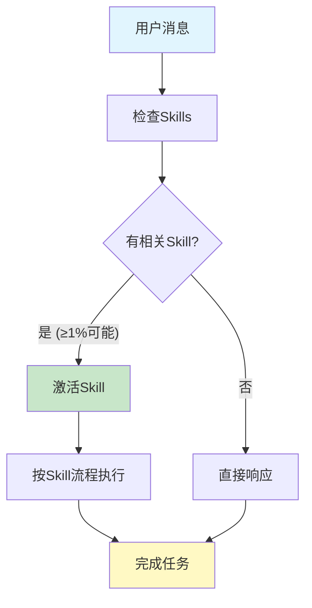

**关键规则：** 即使只有 1% 的可能性某个 Skill 适用，Agent 也必须激活它检查。

---

## 主要组件详解

### 1. brainstorming（头脑风暴）

#### 作用

将模糊的想法转化为完整的设计规格，通过协作式对话逐步细化需求。

#### 适用场景

| 场景 | 说明 |
|------|------|
| 创建新功能 | 任何新功能开发前 |
| 构建组件 | 添加新组件或模块 |
| 修改行为 | 改变现有系统行为 |
| 探索方案 | 需要讨论多种实现方案 |

#### 执行流程

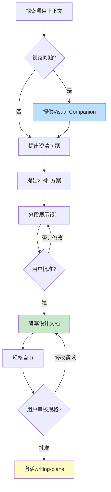

#### Agent 执行动作

| 步骤 | Agent 动作 | 目标 |
|------|-----------|------|
| 1 | 检查文件、文档、最近提交 | 理解项目现状 |
| 2 | 评估范围，必要时分解子项目 | 确保项目可管理 |
| 3 | 一次一个问题，逐步细化 | 深入理解需求 |
| 4 | 提出2-3种方案及权衡 | 探索最佳方案 |
| 5 | 分段展示设计，每段确认 | 获得用户批准 |
| 6 | 保存设计文档到 `docs/superpowers/specs/` | 记录设计决策 |
| 7 | 自审规格（检查占位符、矛盾） | 确保规格完整 |
| 8 | 请用户审核规格文档 | 最终确认 |

#### 案例：开发用户认证系统

```
用户: "帮我添加用户登录功能"

Agent: [激活 brainstorming skill]

Agent: "让我先了解一下项目现状..."
       [检查项目结构、现有代码、最近提交]

Agent: "我看到这是一个电商项目，目前没有用户系统。
       几个问题来细化需求："

Agent: "1. 认证方式偏好？
       A) 邮箱+密码（传统）
       B) OAuth（社交登录）
       C) 两者都支持（推荐）"

用户: "C"

Agent: "2. 需要哪些社交登录平台？
       A) Google
       B) GitHub  
       C) 微信
       D) 以上全部"

用户: "A和B"

Agent: "基于你的选择，我推荐三种方案：

       方案A（推荐）: 使用 Auth.js 库
       - 优点: 成熟稳定，支持多种OAuth，社区活跃
       - 缺点: 需要额外依赖

       方案B: 自建JWT系统
       - 优点: 完全控制，无外部依赖
       - 缺点: 需要处理更多安全细节

       方案C: 使用 Supabase Auth
       - 优点: 后端托管，快速集成
       - 缺点: 依赖第三方服务

       我推荐方案A，因为平衡了安全性和开发效率。"

用户: "用方案A"

Agent: "好的，让我分段展示设计：

       === 第一部分：架构概述 ===
       
       采用 Auth.js + NextAuth 架构：
       - 前端: React 组件（登录表单、OAuth按钮）
       - 后端: Auth.js 处理认证流程
       - 存储: JWT session + PostgreSQL 用户表
       
       这部分看起来对吗？"

用户: "对"

Agent: "=== 第二部分：数据模型 ===
       
       User 表:
       - id (UUID, 主键)
       - email (唯一)
       - name
       - image (头像URL)
       - provider (google/github)
       - createdAt
       
       Session 表:
       - id
       - userId
       - expiresAt
       
       这部分看起来对吗？"

用户: "可以，但需要添加 lastLoginAt"

Agent: [更新设计，添加 lastLoginAt]

Agent: "=== 第三部分：API端点 ===
       
       POST /api/auth/signup - 邮箱注册
       POST /api/auth/login - 邮箱登录
       GET /api/auth/callback/:provider - OAuth回调
       POST /api/auth/logout - 登出
       GET /api/auth/session - 获取当前会话
       
       这部分看起来对吗？"

用户: "对"

Agent: [编写完整设计文档]
       [保存到 docs/superpowers/specs/2024-01-15-user-auth-design.md]
       [自审规格]

Agent: "设计文档已保存。请审核：
       docs/superpowers/specs/2024-01-15-user-auth-design.md
       
       确认后我将开始编写实施计划。"

用户: [审核文档] "批准"

Agent: [激活 writing-plans skill]
```

---

### 2. writing-plans（编写计划）

#### 作用

将批准的设计转化为详细的实施计划，每个步骤足够小（2-5分钟），包含完整代码和验证命令。

#### 适用场景

| 场景 | 说明 |
|------|------|
| 设计批准后 | brainstorming 完成后 |
| 多步骤任务 | 需要分解的复杂任务 |
| 有规格文档 | 已有明确需求规格 |

#### 执行流程

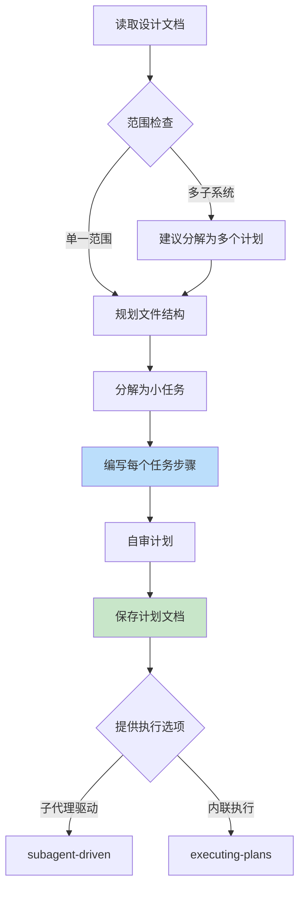

#### 任务结构模板

```markdown
### Task N: [组件名称]

**Files:**
- Create: `exact/path/to/file.py`
- Modify: `exact/path/to/existing.py:123-145`
- Test: `tests/exact/path/to/test.py`

- [ ] **Step 1: Write the failing test**

```python
def test_specific_behavior():
    result = function(input)
    assert result == expected
```

- [ ] **Step 2: Run test to verify it fails**

Run: `pytest tests/path/test.py::test_name -v`
Expected: FAIL with "function not defined"

- [ ] **Step 3: Write minimal implementation**

```python
def function(input):
    return expected
```

- [ ] **Step 4: Run test to verify it passes**

Run: `pytest tests/path/test.py::test_name -v`
Expected: PASS

- [ ] **Step 5: Commit**

```bash
git add tests/path/test.py src/path/file.py
git commit -m "feat: add specific feature"
```
```

#### Agent 执行动作

| 步骤 | Agent 动作 | 目标 |
|------|-----------|------|
| 1 | 读取设计文档 | 理解要实现什么 |
| 2 | 检查范围，必要时分解 | 确保计划可执行 |
| 3 | 规划文件结构 | 明确代码组织 |
| 4 | 分解为小任务（2-5分钟） | 任务可独立完成 |
| 5 | 编写完整代码和命令 | 无占位符 |
| 6 | 自审计划（覆盖度、一致性） | 确保计划完整 |
| 7 | 保存到 `docs/superpowers/plans/` | 记录实施计划 |
| 8 | 提供执行选项 | 让用户选择执行方式 |

#### 案例：认证系统实施计划

```markdown
# 用户认证系统实施计划

> **For agentic workers:** REQUIRED SUB-SKILL: Use superpowers:subagent-driven-development

**Goal:** 实现邮箱+OAuth双认证系统

**Architecture:** Auth.js + PostgreSQL，JWT session

**Tech Stack:** Next.js, Auth.js, PostgreSQL, Prisma

---

### Task 1: 数据模型

**Files:**
- Create: `prisma/schema.prisma`
- Test: `tests/models/user.test.ts`

- [ ] **Step 1: Write the failing test**

```typescript
import { PrismaClient } from '@prisma/client';

describe('User model', () => {
  it('creates user with required fields', async () => {
    const prisma = new PrismaClient();
    const user = await prisma.user.create({
      data: {
        email: 'test@example.com',
        name: 'Test User',
        provider: 'email'
      }
    });
    expect(user.id).toBeDefined();
    expect(user.email).toBe('test@example.com');
  });
});
```

- [ ] **Step 2: Run test to verify it fails**

Run: `npm test tests/models/user.test.ts`
Expected: FAIL - Prisma schema missing User model

- [ ] **Step 3: Write minimal implementation**

```prisma
model User {
  id          String   @id @default(uuid())
  email       String   @unique
  name        String?
  image       String?
  provider    String
  createdAt   DateTime @default(now())
  lastLoginAt DateTime @updatedAt
}

model Session {
  id        String   @id @default(uuid())
  userId    String
  expiresAt DateTime
  user      User     @relation(fields: [userId], references: [id])
}
```

- [ ] **Step 4: Run test to verify it passes**

Run: `npx prisma migrate dev --name init`
Run: `npm test tests/models/user.test.ts`
Expected: PASS

- [ ] **Step 5: Commit**

```bash
git add prisma/schema.prisma tests/models/user.test.ts
git commit -m "feat: add User and Session models"
```

---

### Task 2: Auth.js 配置

**Files:**
- Create: `lib/auth.ts`
- Create: `pages/api/auth/[...nextauth].ts`
- Test: `tests/auth/config.test.ts`

[... 详细步骤 ...]

---

### Task 3: 登录表单组件

**Files:**
- Create: `components/LoginForm.tsx`
- Test: `tests/components/LoginForm.test.tsx`

[... 详细步骤 ...]
```

---

### 3. subagent-driven-development（子代理驱动开发）

#### 作用

通过为每个任务派遣独立的子代理来执行计划，每个任务完成后进行两阶段审查（规格合规 + 代码质量）。

#### 适用场景

| 场景 | 说明 |
|------|------|
| 有实施计划 | writing-plans 已完成 |
| 任务独立 | 任务间无强依赖 |
| 同会话执行 | 在当前会话中执行 |

#### 执行流程

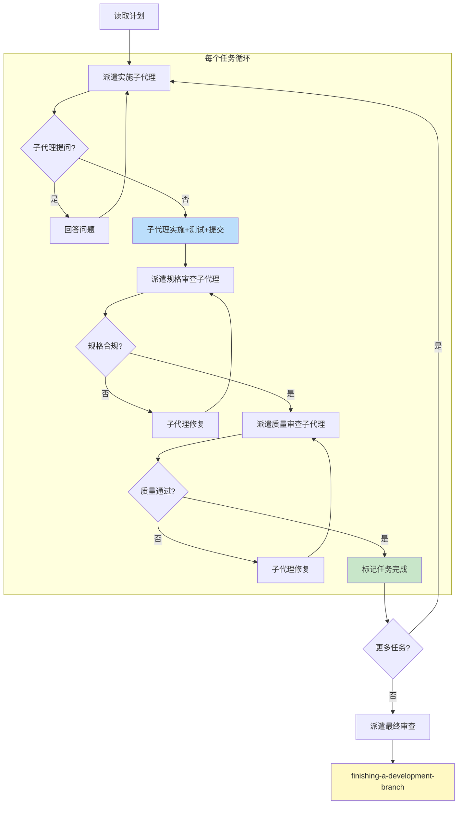

#### 子代理角色

| 角色 | 模型选择 | 职责 |
|------|---------|------|
| **实施者** | 快速模型（简单任务）<br>标准模型（集成任务） | 执行任务、写测试、提交 |
| **规格审查者** | 最强模型 | 检查是否符合规格 |
| **质量审查者** | 最强模型 | 检查代码质量 |

#### Agent 执行动作

| 步骤 | Agent 动作 | 目标 |
|------|-----------|------|
| 1 | 读取计划，提取所有任务 | 理解完整工作范围 |
| 2 | 创建 TodoWrite 任务列表 | 跟踪进度 |
| 3 | 派遣实施子代理（带完整任务文本） | 执行任务 |
| 4 | 回答子代理问题（如有） | 提供上下文 |
| 5 | 派遣规格审查子代理 | 确保符合规格 |
| 6 | 派遣质量审查子代理 | 确保代码质量 |
| 7 | 循环直到所有任务完成 | 完成实施 |
| 8 | 派遣最终审查 | 整体检查 |
| 9 | 激活 finishing-a-development-branch | 完成分支 |

#### 案例：执行认证系统计划

```
Agent: [激活 subagent-driven-development skill]

Agent: "我正在使用子代理驱动开发来执行这个计划。"

Agent: [读取 docs/superpowers/plans/2024-01-15-user-auth-plan.md]
       [提取5个任务]
       [创建 TodoWrite]

Agent: "=== Task 1: 数据模型 ==="

Agent: [派遣实施子代理]
       Prompt: "实施 Task 1: 数据模型
                [完整任务文本]
                上下文: 这是认证系统的第一步..."

实施子代理: "开始前有个问题：PostgreSQL版本要求？"

Agent: "使用项目现有的 PostgreSQL 14"

实施子代理: [实施 Prisma schema]
           [写测试]
           [运行测试 - PASS]
           [提交]
           "完成。自审：无问题。"

Agent: [派遣规格审查子代理]
       Prompt: "审查 Task 1 是否符合规格
                规格: docs/superpowers/specs/2024-01-15-user-auth-design.md
                提交范围: a1b2c3..d4e5f6"

规格审查子代理: "✅ 规格合规
                 - User 表字段全部存在
                 - Session 表正确关联
                 - 无额外未请求内容"

Agent: [派遣质量审查子代理]
       Prompt: "审查 Task 1 代码质量
                提交范围: a1b2c3..d4e5f6"

质量审查子代理: "Strengths: 清晰的模型定义
                 Issues: None
                 ✅ Approved"

Agent: [标记 Task 1 完成]

Agent: "=== Task 2: Auth.js 配置 ==="

[... 循环执行 ...]

Agent: "=== 所有任务完成 ==="

Agent: [派遣最终审查子代理]

最终审查子代理: "整体审查结果:
                 - 所有规格要求已实现
                 - 测试覆盖率 92%
                 - 无关键问题
                 ✅ Ready to merge"

Agent: [激活 finishing-a-development-branch skill]
```

---

### 4. test-driven-development（测试驱动开发）

#### 作用

强制执行 RED-GREEN-REFACTOR 循环，确保所有代码都有测试先行。

#### 适用场景

| 场景 | 说明 |
|------|------|
| 新功能 | 任何新功能开发 |
| Bug修复 | 修复任何bug |
| 重构 | 代码重构 |
| 行为变更 | 改变现有行为 |

#### RED-GREEN-REFACTOR 循环

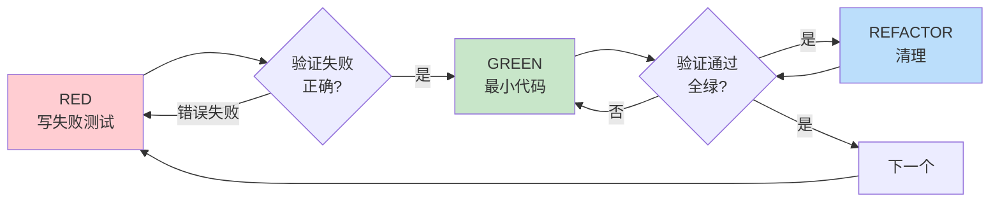

#### 铁律

```
没有失败测试先行，不写任何生产代码
```

**如果写了代码再写测试：删除代码，重新开始。**

#### Agent 执行动作

| 步骤 | Agent 动作 | 目标 |
|------|-----------|------|
| 1 | 写一个失败的测试 | 定义期望行为 |
| 2 | 运行测试，确认失败 | 证明测试有效 |
| 3 | 写最小代码使测试通过 | 实现功能 |
| 4 | 运行测试，确认通过 | 验证实现 |
| 5 | 重构（可选） | 改善代码 |
| 6 | 重复下一个测试 | 继续开发 |

#### 案例：修复空邮箱被接受的Bug

```
Bug: 系统接受空邮箱地址

Agent: [激活 test-driven-development skill]

Agent: "=== RED: 写失败测试 ==="

```typescript
test('rejects empty email', async () => {
  const result = await submitForm({ email: '' });
  expect(result.error).toBe('Email required');
});
```

Agent: "=== 验证 RED ==="

Run: `npm test`
Output: FAIL: expected 'Email required', got undefined

Agent: "测试正确失败 - 功能缺失"

Agent: "=== GREEN: 最小实现 ==="

```typescript
function submitForm(data: FormData) {
  if (!data.email?.trim()) {
    return { error: 'Email required' };
  }
  // ... 其他逻辑
}
```

Agent: "=== 验证 GREEN ==="

Run: `npm test`
Output: PASS

Agent: "=== REFACTOR ==="

[提取验证函数用于多字段]

Agent: "=== 完成 ==="

Commit: `git commit -m "fix: reject empty email in form submission"`
```

---

### 5. systematic-debugging（系统化调试）

#### 作用

通过四阶段流程找到根本原因，避免随机修复浪费时间。

#### 适用场景

| 场景 | 说明 |
|------|------|
| 测试失败 | 任何测试失败 |
| 生产Bug | 生产环境问题 |
| 异常行为 | 非预期行为 |
| 性能问题 | 性能瓶颈 |
| 构建失败 | 构建错误 |

#### 四阶段流程

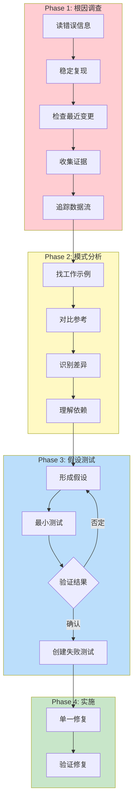

#### 铁律

```
没有根因调查，不尝试任何修复
```

#### Agent 执行动作

| 阶段 | Agent 动作 | 目标 |
|------|-----------|------|
| **Phase 1** | 读错误、复现、检查变更、收集证据 | 理解 WHAT 和 WHY |
| **Phase 2** | 找工作示例、对比差异 | 识别问题模式 |
| **Phase 3** | 形成假设、最小测试 | 科学验证 |
| **Phase 4** | 创建测试、单一修复、验证 | 解决问题 |

#### 案例：调试签名失败

```
问题: macOS 应用签名失败

Agent: [激活 systematic-debugging skill]

Agent: "=== Phase 1: 根因调查 ==="

Agent: "1. 读错误信息..."
       Error: "no identity found for signing"

Agent: "2. 复现问题..."
       Run: `codesign --sign "$IDENTITY" app.app`
       Result: 每次都失败

Agent: "3. 检查最近变更..."
       Git diff: 新增了 CI workflow

Agent: "4. 收集证据（多组件系统）..."
       
       ```bash
       # Layer 1: Workflow secrets
       echo "IDENTITY: ${IDENTITY:+SET}${IDENTITY:-UNSET}"
       # Output: IDENTITY: SET
       
       # Layer 2: Build script env
       env | grep IDENTITY
       # Output: IDENTITY not in environment
       
       # Layer 3: Keychain state
       security list-keychains
       # Output: Only system keychain
       
       # Layer 4: Signing
       codesign --sign "$IDENTITY" --verbose=4 app.app
       # Error: no identity found
       ```
       
       发现: Workflow → Build script 层丢失了环境变量

Agent: "=== Phase 2: 模式分析 ==="

Agent: "找工作示例..."
       检查本地签名脚本 - 使用 `security import` 导入密钥

Agent: "对比差异..."
       CI 缺少密钥导入步骤

Agent: "=== Phase 3: 假设测试 ==="

Agent: "假设: CI workflow 需要先导入密钥到临时 keychain"

Agent: "最小测试..."
       在 workflow 添加密钥导入步骤
       
       Result: 签名成功

Agent: "=== Phase 4: 实施 ==="

Agent: "创建失败测试..."
       [写测试验证签名流程]

Agent: "单一修复..."
       添加密钥导入步骤到 CI workflow

Agent: "验证修复..."
       Run: `npm test`
       Result: PASS

Agent: "修复完成。根本原因: CI workflow 缺少密钥导入步骤"
```

---

### 6. using-git-worktrees（使用 Git Worktrees）

#### 作用

创建隔离的工作空间，允许多分支并行开发而不互相干扰。

#### 适用场景

| 场景 | 说明 |
|------|------|
| 开始功能开发 | 需要隔离工作空间 |
| 执行实施计划 | 计划执行前准备 |
| 并行开发 | 多功能同时开发 |

#### 目录选择流程

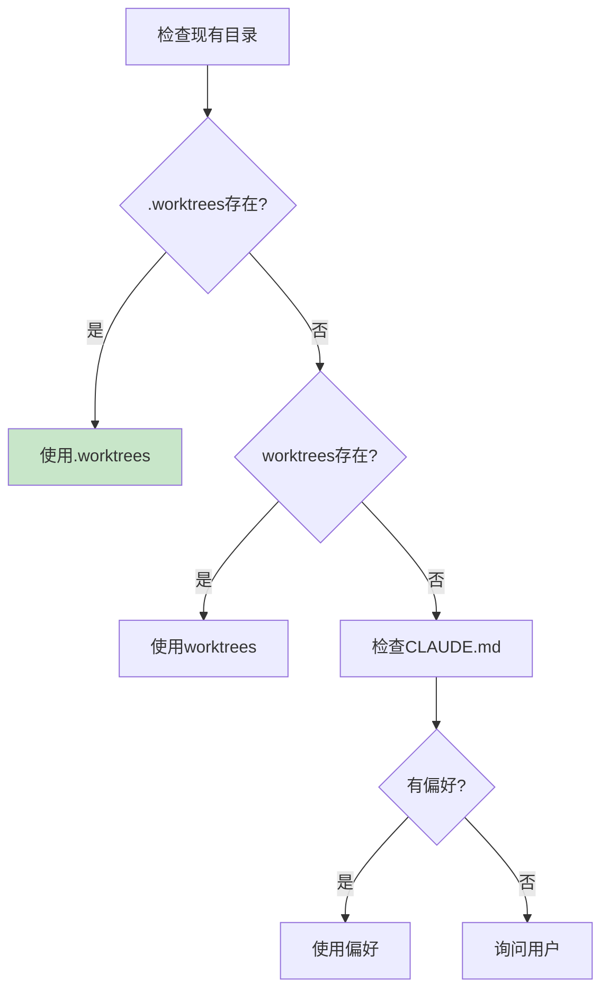

#### Agent 执行动作

| 步骤 | Agent 动作 | 目标 |
|------|-----------|------|
| 1 | 检查现有目录 | 遵循项目约定 |
| 2 | 验证目录被 gitignore | 防止意外提交 |
| 3 | 创建 worktree + 新分支 | 隔离工作空间 |
| 4 | 运行项目设置（npm install等） | 准备环境 |
| 5 | 运行测试验证基线 | 确保干净起点 |
| 6 | 报告位置和状态 | 通知用户 |

#### 案例：创建认证功能 Worktree

```
Agent: [激活 using-git-worktrees skill]

Agent: "我正在使用 git worktrees skill 设置隔离工作空间。"

Agent: [检查 .worktrees/ - 存在]
       [验证 git check-ignore - .worktrees/ 已被忽略]

Agent: "创建 worktree..."
       Run: `git worktree add .worktrees/auth -b feature/auth`
       
Agent: "运行项目设置..."
       Run: `cd .worktrees/auth && npm install`
       
Agent: "验证测试基线..."
       Run: `npm test`
       Result: 47 passing, 0 failures

Agent: "Worktree 准备完成:
       - 位置: /Users/jesse/myproject/.worktrees/auth
       - 分支: feature/auth
       - 测试: 47 passing
       - 准备实施认证功能"
```

---

### 7. requesting-code-review（请求代码审查）

#### 作用

派遣代码审查子代理，在任务完成后检查代码质量。

#### 适用场景

| 场景 | 说明 |
|------|------|
| 任务完成后 | 每个任务完成后 |
| 主要功能完成 | 大功能完成后 |
| 合并前 | 合并到主分支前 |

#### Agent 执行动作

| 步骤 | Agent 动作 | 目标 |
|------|-----------|------|
| 1 | 获取 git SHA | 确定审查范围 |
| 2 | 派遣 code-reviewer 子代理 | 执行审查 |
| 3 | 处理反馈 | 修复问题 |
| 4 | 继续或迭代 | 完成审查 |

#### 审查结果处理

| 严重性 | 处理方式 |
|--------|---------|
| **Critical** | 立即修复，阻塞进度 |
| **Important** | 修复后再继续 |
| **Minor** | 记录，稍后处理 |

---

### 8. finishing-a-development-branch（完成开发分支）

#### 作用

验证测试通过，提供完成选项（合并/PR/保留/丢弃），清理 worktree。

#### 适用场景

| 场景 | 说明 |
|------|------|
| 实施完成 | 所有任务完成 |
| 测试通过 | 测试全部通过 |
| 需要集成 | 决定如何集成代码 |

#### 完成选项

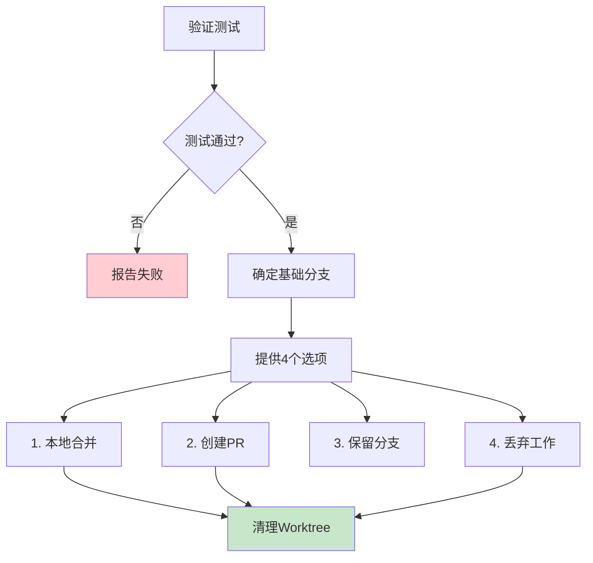

#### Agent 执行动作

| 步骤 | Agent 动作 | 目标 |
|------|-----------|------|
| 1 | 运行测试 | 验证代码质量 |
| 2 | 确定基础分支 | 知道合并目标 |
| 3 | 提供4个选项 | 让用户选择 |
| 4 | 执行用户选择 | 完成集成 |
| 5 | 清理 worktree（如需要） | 清理环境 |

---

### 9. dispatching-parallel-agents（派遣并行代理）

#### 作用

当有多个独立问题时，派遣多个子代理并行处理，提高效率。

#### 适用场景

| 场景 | 说明 |
|------|------|
| 多个独立失败 | 不同测试文件失败 |
| 多子系统问题 | 不同子系统独立问题 |
| 无共享状态 | 问题间无依赖 |

#### 决策流程

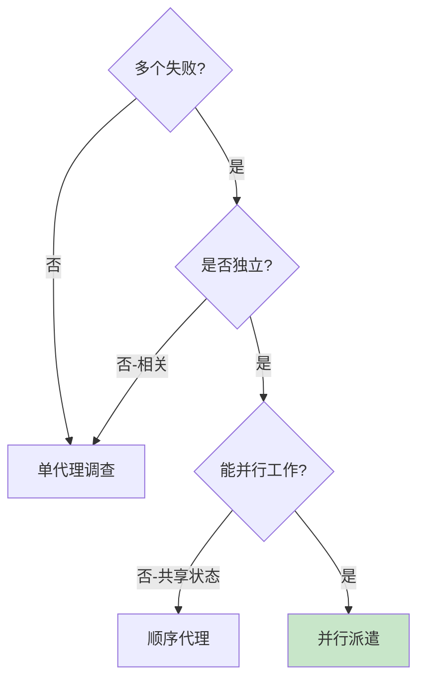

#### 案例：并行修复多个测试失败

```
问题: 6个测试失败，分布在3个文件

Agent: [激活 dispatching-parallel-agents skill]

Agent: "分析失败..."
       - agent-tool-abort.test.ts: 3 failures (timing issues)
       - batch-completion.test.ts: 2 failures (tools not executing)
       - tool-approval.test.ts: 1 failure (execution count = 0)

Agent: "判断: 独立问题域 - abort逻辑、batch完成、race条件各独立"

Agent: "并行派遣3个代理..."

[Agent 1] → Fix agent-tool-abort.test.ts
[Agent 2] → Fix batch-completion.test.ts  
[Agent 3] → Fix tool-approval.test.ts

[等待所有代理完成]

Agent 1: "修复: 替换timeout为事件等待"
Agent 2: "修复: 事件结构bug (threadId位置错误)"
Agent 3: "修复: 添加异步工具执行等待"

Agent: "整合结果..."
       [检查无冲突]
       [运行完整测试套件]
       Result: 全部通过

Agent: "3个问题并行解决，节省时间"
```

---

### 10. verification-before-completion（完成前验证）

#### 作用

确保在声称完成前有新鲜验证证据，防止虚假完成声明。

#### 适用场景

| 场景 | 说明 |
|------|------|
| 声称完成 | 任何完成声明前 |
| 提交/PR前 | 代码提交前 |
| 任务完成 | 标记任务完成前 |

#### 铁律

```
没有新鲜验证证据，不声称任何状态
```

#### 验证门控

```
BEFORE 声称任何状态:

1. IDENTIFY: 什么命令证明这个声明?
2. RUN: 执行完整命令（新鲜、完整）
3. READ: 完整输出，检查退出码，计算失败数
4. VERIFY: 输出确认声明?
   - NO: 用证据说明实际状态
   - YES: 用证据声称
5. ONLY THEN: 做出声明
```

---

### 11. receiving-code-review（接收代码审查）

#### 作用

正确处理代码审查反馈，技术严谨而非表演式同意。

#### 适用场景

| 场景 | 说明 |
|------|------|
| 收到审查反馈 | 任何代码审查反馈 |
| 反馈不清楚 | 需要澄清的反馈 |
| 反馈可能错误 | 技术上可疑的反馈 |

#### 响应模式

```
WHEN 收到代码审查反馈:

1. READ: 完整阅读，不反应
2. UNDERSTAND: 用自己的话重述（或询问）
3. VERIFY: 对照代码库现实检查
4. EVALUATE: 对此代码库技术上合理?
5. RESPOND: 技术确认或理性反驳
6. IMPLEMENT: 一项一项，每项测试
```

#### 禁止响应

| 禁止 | 原因 |
|------|------|
| "You're absolutely right!" | CLAUDE.md 明确禁止 |
| "Great point!" | 表演式同意 |
| "Let me implement now" | 未验证就实施 |

---

## 完整工作流程

### 标准开发流程

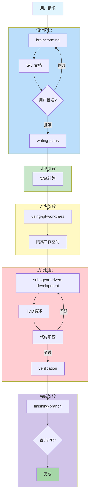

### 调试流程

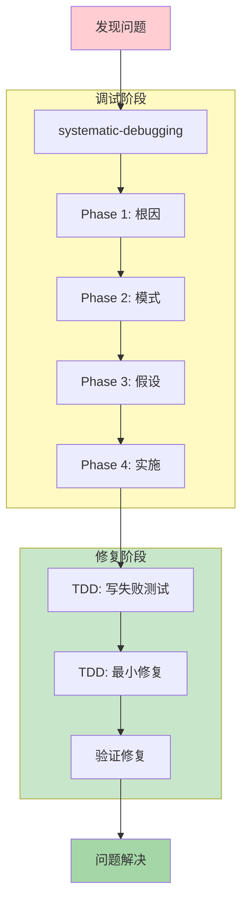

---

## 实战案例

### 案例 1：完整功能开发

**场景：** 为电商网站添加购物车功能

```
=== 阶段 1: Brainstorming ===

用户: "帮我添加购物车功能"

Agent: [激活 brainstorming]

Agent: "让我了解项目..."
       [检查项目结构 - Next.js电商应用]

Agent: "几个问题来细化需求："

Agent: "1. 购物车存储位置？
       A) 仅前端（localStorage）
       B) 后端数据库（持久化）
       C) 混合（前端缓存+后端同步）"

用户: "C"

Agent: "2. 需要哪些功能？
       A) 添加/删除商品
       B) 修改数量
       C) 计算总价
       D) 以上全部 + 优惠券"

用户: "D"

Agent: "推荐方案：
       - 使用 Zustand 管理前端状态
       - PostgreSQL 存储后端数据
       - API 同步两端
       
       这看起来对吗？"

用户: "对"

Agent: [分段展示设计]
       [保存设计文档]
       [用户审核批准]

=== 阶段 2: Writing Plans ===

Agent: [激活 writing-plans]

Agent: [编写详细计划]
       - Task 1: 数据模型（Cart, CartItem）
       - Task 2: Zustand store
       - Task 3: API endpoints
       - Task 4: 购物车组件
       - Task 5: 优惠券逻辑

Agent: "计划保存到 docs/superpowers/plans/2024-01-20-cart-plan.md
       
       执行选项：
       1. 子代理驱动（推荐）
       2. 内联执行
       
       选择哪个？"

用户: "1"

=== 阶段 3: Git Worktrees ===

Agent: [激活 using-git-worktrees]

Agent: [创建 .worktrees/cart]
       [运行 npm install]
       [验证测试基线 - 52 passing]

=== 阶段 4: Subagent-Driven Development ===

Agent: [激活 subagent-driven-development]

Agent: "=== Task 1: 数据模型 ==="

[派遣实施子代理]
[规格审查 ✅]
[质量审查 ✅]

Agent: "=== Task 2: Zustand store ==="

[派遣实施子代理]
[规格审查 - 发现问题: 缺少持久化逻辑]
[子代理修复]
[规格审查 ✅]
[质量审查 ✅]

[... 继续所有任务 ...]

=== 阶段 5: Finishing ===

Agent: [激活 finishing-a-development-branch]

Agent: "验证测试..."
       Run: `npm test`
       Result: 67 passing

Agent: "实施完成。选项：
       1. 本地合并到 main
       2. 创建 Pull Request
       3. 保留分支
       4. 丢弃工作"

用户: "2"

Agent: [推送分支]
       [创建 PR]
       [清理 worktree]

Agent: "PR 已创建: #42
       https://github.com/.../pull/42"
```

### 案例 2：系统化调试

**场景：** CI构建突然失败

```
问题: GitHub Actions 构建失败，错误 "Module not found"

Agent: [激活 systematic-debugging]

=== Phase 1: 根因调查 ===

Agent: "读错误信息..."
       Error: "Cannot find module '@org/shared'"

Agent: "复现问题..."
       本地运行: `npm run build` - 成功
       CI 环境: 失败

Agent: "检查最近变更..."
       Git log: 3小时前更新了 package.json

Agent: "收集证据..."
       ```bash
       # 检查 package.json
       cat package.json | grep @org/shared
       # Output: "@org/shared": "^1.2.0"
       
       # 检查 node_modules
       ls node_modules/@org/
       # Output: shared/ 存在
       
       # 检查 CI 日志
       # npm install 输出: "WARN: @org/shared@1.2.0 requires peer npm@>=8"
       # CI npm version: 6.14.0
       ```

Agent: "发现: CI 的 npm 版本过低"

=== Phase 2: 模式分析 ===

Agent: "找工作示例..."
       其他成功构建使用 npm 8+

Agent: "对比差异..."
       CI 使用默认 npm 6，本地使用 npm 9

=== Phase 3: 假设测试 ===

Agent: "假设: CI 需要升级 npm 到 8+"

Agent: "最小测试..."
       在 workflow 添加: `npm install -g npm@latest`
       
       Result: 构建成功

=== Phase 4: 实施 ===

Agent: [激活 TDD]
       [写测试验证 npm 版本]
       [修复 CI workflow]
       [验证修复]

Agent: "根本原因: CI npm 版本不满足 peer dependency
       修复: 在 workflow 中升级 npm"
```

---

## 最佳实践

### Skill 使用原则

| 原则 | 说明 |
|------|------|
| **强制执行** | Skill 适用时必须使用，无选择 |
| **优先级** | 流程 Skill > 实施 Skill |
| **完整遵循** | 按 Skill 流程完整执行 |
| **不跳过** | 即使"简单"也不跳过 |

### 常见错误

| 错误 | 正确做法 |
|------|---------|
| "这太简单不需要设计" | 所有项目都需要设计 |
| "先写代码再写测试" | 删除代码，TDD重来 |
| "快速修复，稍后调查" | 系统化调试，找根因 |
| "应该能工作了" | 运行验证命令 |
| "跳过审查，直接合并" | 审查后再合并 |

### Red Flags（红旗）

当出现以下想法时，**停止并遵循流程**：

| 想法 | 现实 |
|------|------|
| "只是简单问题" | 简单问题也有根因 |
| "紧急，没时间流程" | 系统化更快 |
| "先试试这个" | 先调查再修复 |
| "测试后写" | 测试先行证明有效 |
| "删除代码浪费" | 沉没成本谬误 |

---

## 总结

Superpowers 通过一套精心设计的 Skills，将最佳实践强制嵌入 Agent 的工作流程中。每个 Skill 都有明确的触发条件、执行流程和验证步骤，确保：

1. **设计先行** - brainstorming 确保需求清晰
2. **计划详细** - writing-plans 确保实施可控
3. **测试驱动** - TDD 确保代码质量
4. **系统调试** - systematic-debugging 确保根因修复
5. **验证完成** - verification 确保真实完成

这套方法论让 Agent 从"猜测式编程"转变为"系统化开发"，大幅提高代码质量和开发效率。

---

> **作者:** jwtiger  
> **文档版本:** 1.0  
> **最后更新:** 2024-01-20